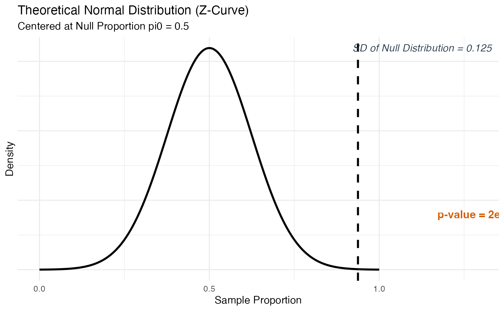
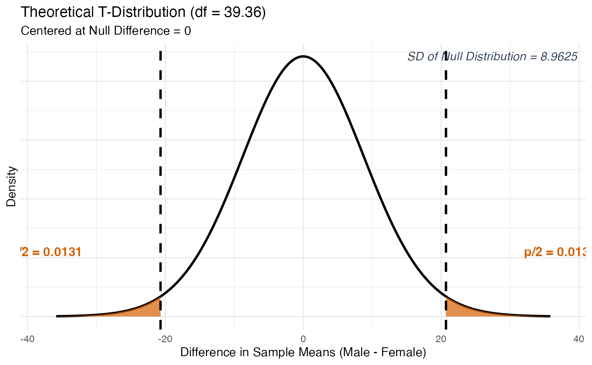

# Getting Started with Stat218Applet

------------------------------------------------------------------------

### Motivation

This package grew out of teaching STAT 218:Introduction to Statistics to
undergraduates at UNL this semester. The course uses the textbook
*Introduction to Statistical Investigations* (ISI) by Tintle et al.,
which comes with its own web-based applet interface for running
simulations and tests. That applet works, but it keeps students at arm’s
length from real data analysis tools. I wanted something that lived
inside R and RStudio, so students could run inference, see polished
visualizations, and at the same time start building intuition for how R
itself works: naming objects, exploring your environment, reading
dataset documentation, and understanding what different kinds of outputs
look like.

The idea for the three-part object structure came directly from learning
about S3 objects in this course (STAT-892: Development of a statistical
software) taught by Dr. Heike Hofmann. That gave me the idea: why not
create a test object or a confidence interval object, and then dispatch
[`print()`](https://rdrr.io/r/base/print.html),
[`plot()`](https://rdrr.io/r/graphics/plot.default.html), and
[`plot_steps()`](https://asifenan.github.io/Stat218Applet/reference/plot_steps.md)
from it? Every function in this package follows exactly that pattern.
The result is a consistent workflow: you run a function, store the
result, and then explore it in three different ways.

One other early idea was to include animations that would show the
simulation process building up step by step. After thinking it through,
I decided that was too ambitious for what this course needed right now,
and I pivoted to a clean, well-structured static package instead.

The package is currently named `Stat218Applet`, though the name I had in
mind from early on was R4IntroStats, something that signals the
package’s broader purpose beyond any single course number at any single
university. The rename never happened for a practical reason: by the
time the full scope of the package came together, the GitHub repository
was set up, the pkgdown site was live, and every function, namespace
entry, and documentation file was already tied to the current name.
Rather than risk breaking anything at that stage, I kept Stat218Applet
as the working name with the intention that a proper rename to
R4IntroStats would be a cleaner operation, if the package ever reaches a
more stable, CRAN-submission state.

------------------------------------------------------------------------

### Who Is This Package For?

This package is designed for introductory statistics students and
instructors, not just at UNL, but at any university that teaches a
course at the level of ISI. The package is intentionally built to be a
gentle on-ramp to statistical concepts and to R and R Studio. Students
who have never programmed before will get practice:

- Storing results in named objects and seeing them appear in their
  RStudio Environment pane
- Passing those objects into different functions (`print`, `plot`,
  `plot_steps`) and understanding what each does
- Reading dataset documentation with `?dataset_name` and function
  documentation with `?function_name`
- Working with data frames, formulas, and the `~` notation

Every function and every bundled dataset has detailed, readable help
documentation written with intro-stats students in mind. If a student
gets confused about what an argument does,
[`?test_1mean`](https://asifenan.github.io/Stat218Applet/reference/test_1mean.md)
will give them a full plain-English explanation. That is by design.

------------------------------------------------------------------------

### A Note on Terminology: 2SD, Simulation, and Theory

This package uses the language of the ISI textbook directly. The three
inference methods are called **2SD**, **simulation**, and **theory**
throughout. These correspond to:

- **2SD**: A simulation-based confidence interval method using the rule
  *statistic ± 2 × SD of the bootstrap distribution*. This is
  intentionally restricted to 95% confidence intervals because that is
  how the book introduces the concept. For other confidence levels, use
  `"simulation"`.
- **simulation**: A general simulation-based approach (bootstrap for
  CIs, randomization/permutation/sign-flipping for tests) that works for
  any confidence level or any hypothesis direction.
- **theory**: The formula-based approach using Z or T distributions,
  appropriate when validity conditions are met.

If you are familiar with other statistics courses or textbooks, “2SD” is
essentially a simplified bootstrap interval, and “simulation” is the
full bootstrap or randomization test. The naming follows ISI so that
students can move between the textbook and this package without
confusion.

------------------------------------------------------------------------

### Student-Friendly Design

A few design decisions worth knowing about upfront:

**Error messages** use the `cli` package and are written to be readable,
not alarming. If you supply the wrong combination of arguments, the
message will tell you exactly what went wrong and how to fix it.

**Printed output** is formatted for a freshman or sophomore audience.
Running `print(result)` on any object produces a clean, labeled summary
– not a raw R dump.

**Validity warnings** appear consistently in
[`print()`](https://rdrr.io/r/base/print.html),
[`plot()`](https://rdrr.io/r/graphics/plot.default.html), and
[`plot_steps()`](https://asifenan.github.io/Stat218Applet/reference/plot_steps.md)
whenever conditions for theory-based inference are questionable. A
student who never looks at the printed output will still see the warning
if they call [`plot()`](https://rdrr.io/r/graphics/plot.default.html).
These warnings are informational, not errors – the function still runs.

**Dual input routing** means every function accepts input in two ways:
either as summary statistics (the way textbook problems are usually
presented) or as raw data via `formula` and `data`. Students who are
working from a textbook exercise can pass in `successes` and `n`
directly. Students doing a project with a real dataset can load it into
R and pass in the data frame.

------------------------------------------------------------------------

### The show_symbols Helper

One persistent challenge in intro stats, and all other instructors will
agree with me, is that students confuse population parameters with
sample statistics – writing μ when they mean x̄, or π when they mean p̂.
The
[`show_symbols()`](https://asifenan.github.io/Stat218Applet/reference/show_symbols.md)
function addresses this directly by displaying a reference table of all
symbols used in the course.

``` r
# See symbols for proportions
show_symbols("proportions")

# See symbols for means
show_symbols("means")

# See symbols for regression and correlation
show_symbols("regression")

# See a table of common symbol mix-ups
show_symbols("mistakes")

# See all four panels at once
show_symbols("all")
```

This function is designed to be pulled up during class, during office
hours, or any time a student is unsure which symbol belongs in their
hypothesis statement.

------------------------------------------------------------------------

### The Bundled Datasets

The package includes 32 datasets drawn from the ISI textbook, covering
the chapters relevant to the functions in this package. Most come from
Chapters P, 2, 3, 5, 6, 7, and 10 of ISI. Each dataset is documented –
type
[`?dolphin`](https://asifenan.github.io/Stat218Applet/reference/dolphin.md),
[`?yawning`](https://asifenan.github.io/Stat218Applet/reference/yawning.md),
or
[`?haircuts`](https://asifenan.github.io/Stat218Applet/reference/haircuts.md)
to read about what the data represents, where it came from, and which
chapter uses it. A few examples:

| Dataset           | Chapter | Used for                    |
|-------------------|---------|-----------------------------|
| `dolphin`         | Ch. 1/P | One-proportion test         |
| `yawning`         | Ch. 5   | Two-proportion test         |
| `organdonor`      | Ch. 5   | Two-proportion test         |
| `haircuts`        | Ch. 2/6 | One-mean and two-mean tests |
| `closefriends`    | Ch. 6   | Two-mean test               |
| `firstbase`       | Ch. 7   | Paired test                 |
| `jjvsbicycle`     | Ch. 7   | Paired test                 |
| `oldfaithful2`    | Ch. 6   | Two-mean test               |
| `handwidth`       | Ch. 10  | Correlation and regression  |
| `examtimesscores` | Ch. 10  | Regression                  |

------------------------------------------------------------------------

### Two-Phase Development

The package was built using a breadth-first approach. In **Phase 1**,
all functions were sketched out and built to accept summary statistics
only. The goal was to have the full scope of the package exist before
polishing any single function. In **Phase 2**, every function was
updated to also accept raw data via `formula` and `data`. Phase 2 also
introduced
[`table_regression()`](https://asifenan.github.io/Stat218Applet/reference/table_regression.md),
[`show_symbols()`](https://asifenan.github.io/Stat218Applet/reference/show_symbols.md),
and the boxplot mode in
[`explore_2vars()`](https://asifenan.github.io/Stat218Applet/reference/explore_2vars.md).

------------------------------------------------------------------------

## Part 1: Hypothesis Testing Functions

All hypothesis test functions return an S3 object. You store it, then
explore it with [`print()`](https://rdrr.io/r/base/print.html),
[`plot()`](https://rdrr.io/r/graphics/plot.default.html), and
[`plot_steps()`](https://asifenan.github.io/Stat218Applet/reference/plot_steps.md).
The sections below walk through each function using real datasets from
the package.

------------------------------------------------------------------------

### test_1prop() – One Proportion Test

Tests whether a single population proportion π equals a hypothesized
value. Accepts either summary statistics (`successes`, `n`) or raw data
(`formula`, `data`, `success_level`). Uses either simulation (The Great
Shuffle) or a theory-based Z-test.

``` r
# Summary statistics path -- theory method
# Testing whether dolphins trained with the "yes" signal respond more than 50% of the time
# (from the ISI dolphin study: 15 out of 16 correct responses)
result_1prop <- test_1prop(
  successes   = 15,
  n           = 16,
  null_pi     = 0.5,
  alternative = "greater",
  method      = "theory"
)
#> Warning: ! Validity conditions for the theory-based Z-test may not be met.
#> ℹ Expected successes under H0: 8 (need >= 10)
#> ℹ Expected failures under H0: 8 (need >= 10)
#> ℹ Consider using `method = "simulation"` for a more reliable p-value.
print(result_1prop)
#> 
#> ── 1-Sample Proportion Test (Theory) ───────────────────────────────────────────
#> ℹ Sample Proportion (p-hat): 0.9375 (15/16)
#> ℹ Null Hypothesis (pi0): 0.5
#> ℹ Alternative: greater
#> • SD of Null Distribution: 0.125
#> • Test Statistic (Z): 3.5
#> • P-Value: 2e-04
```

``` r
# Single ggplot -- safe to render
plot(result_1prop)
```



``` r
# 3-panel patchwork -- run in RStudio
plot_steps(result_1prop)
```

``` r
data(dolphin)
# Raw data path -- simulation method using the bundled dolphin dataset
result_1prop_sim <- test_1prop(
  formula       = ~ response,
  data          = dolphin,
  success_level = "Improve",
  null_pi       = 0.5,
  alternative   = "greater",
  method        = "simulation",
  sim_reps      = 1000
)
print(result_1prop_sim)
```

``` r
# Dotplot is available for simulation -- single ggplot, renders cleanly
plot(result_1prop_sim, plot_type = "dotplot")
```

------------------------------------------------------------------------

### test_1mean() – One Mean Test

Tests whether a single population mean μ equals a hypothesized value.
The `sd_type` argument distinguishes between a known population σ
(Z-test) and an estimated sample s (T-test). Simulation uses a
parametric bootstrap centered at the null value.

``` r
# Raw data path -- theory T-test
# Testing whether students underestimate a 10-second interval (null: mu = 10)
result_1mean <- test_1mean(
  formula     = ~ estimate,
  data        = timeestimate,
  null_mu     = 10,
  alternative = "two.sided",
  method      = "theory"
)
print(result_1mean)
```

``` r
plot(result_1mean)
```

``` r
plot_steps(result_1mean)
```

``` r
# Summary statistics path -- theory T-test
result_1mean_s <- test_1mean(
  x_bar       = 9.1,
  n           = 48,
  sd_val      = 2.4,
  sd_type     = "sample",
  null_mu     = 10,
  alternative = "two.sided",
  method      = "theory"
)
print(result_1mean_s)
#> 
#> ── 1-Sample Mean Hypothesis Test (Theory) ──────────────────────────────────────
#> ℹ Observed Mean (x-bar): 9.1
#> ℹ Standard Deviation (s): 2.4 | n: 48
#> ℹ Null Hypothesis (mu0): 10
#> ℹ Alternative: two.sided
#> • SD of Null Distribution: 0.3464
#> • Test Statistic (T): -2.598
#> • P-Value: 0.0125
```

``` r
# Simulation path -- parametric bootstrap (requires raw data)
result_1mean_sim <- test_1mean(
  formula     = ~ estimate,
  data        = timeestimate,
  null_mu     = 10,
  alternative = "two.sided",
  method      = "simulation",
  sim_reps    = 1000
)
print(result_1mean_sim)
```

------------------------------------------------------------------------

### test_2prop() – Two Proportion Test

Tests whether two population proportions are equal (H₀: π₁ − π₂ = 0).
Uses either a randomization test (simulation) or a pooled Z-test
(theory). The [`plot()`](https://rdrr.io/r/graphics/plot.default.html)
method for this function returns a **patchwork** object – the null
distribution on top and a formatted 2×2 contingency table on the bottom
– so it should be run interactively.

``` r
# Summary statistics path -- theory
# Yawning study: does seeing someone yawn make you more likely to yawn?
result_2prop <- test_2prop(
  success_1   = 10,
  n_1         = 34,
  success_2   = 4,
  n_2         = 16,
  group_names = c("Yawn Seed", "No Seed"),
  alternative = "greater",
  method      = "theory"
)
#> Warning: ! Validity conditions for the theory-based Z-test may not be met.
#> ℹ All four cells in the 2x2 table must have at least 10 observations.
#> ℹ Minimum cell count found: 4
#> ℹ Consider using `method = "simulation"` for a more reliable p-value.
print(result_2prop)
#> 
#> ── 2-Sample Proportions Hypothesis Test (Theory) ───────────────────────────────
#> ℹ Yawn Seed: p1-hat = 0.2941 (successes = 10, n = 34)
#> ℹ No Seed: p2-hat = 0.25 (successes = 4, n = 16)
#> ℹ Null Hypothesis: pi1 - pi2 = 0
#> ℹ Alternative: pi1 - pi2 > 0
#> • Observed Difference (p1-hat - p2-hat): 0.0441
#> • SD of Null Distribution: 0.1361
#> • Test Statistic (Z): 0.324
#> • P-Value: 0.3729
#> Warning: ! Validity conditions for the theory-based Z-test may not be met.
#> ℹ All four cells in the 2x2 table must have at least 10 observations.
#> ℹ Minimum cell count found: 4.
#> ℹ Consider using `method = "simulation"` for a more reliable result.
```

``` r
# Patchwork (null distribution + contingency table) -- run in RStudio
plot(result_2prop)
plot_steps(result_2prop)
```

``` r
# Raw data path -- using the bundled yawning dataset
result_2prop_raw <- test_2prop(
  formula       = response ~ yawn_seed,
  data          = yawning,
  success_level = "Yawn",
  alternative   = "greater",
  method        = "simulation"
)
print(result_2prop_raw)
```

> **Note:** [`plot()`](https://rdrr.io/r/graphics/plot.default.html) for
> [`test_2prop()`](https://asifenan.github.io/Stat218Applet/reference/test_2prop.md)
> and
> [`ci_2prop()`](https://asifenan.github.io/Stat218Applet/reference/ci_2prop.md)
> combines a null distribution plot with a gt contingency table using
> patchwork. Run it interactively in RStudio to see the full layout.

------------------------------------------------------------------------

### test_2mean() – Two Mean Test

Tests whether two population means are equal (H₀: μ₁ − μ₂ = 0). Theory
uses an unpooled T-test with Satterthwaite degrees of freedom.
Simulation uses a permutation test (requires raw data). An optional
boxplot is available when raw data is provided.

``` r
# Summary statistics path -- theory T-test
# Do men and women pay different amounts for haircuts?
result_2mean <- test_2mean(
  x_bar_1     = 28.5,
  sd_1        = 23.1,
  n_1         = 25,
  x_bar_2     = 49.2,
  sd_2        = 38.4,
  n_2         = 25,
  group_names = c("Male", "Female"),
  alternative = "two.sided",
  method      = "theory"
)
print(result_2mean)
#> 
#> ── 2-Sample Means Hypothesis Test (Theory) ─────────────────────────────────────
#> ℹ Male: x-bar = 28.5 | s = 23.1 | n = 25
#> ℹ Female: x-bar = 49.2 | s = 38.4 | n = 25
#> ℹ Null Hypothesis: mu1 - mu2 = 0
#> ℹ Alternative: mu1 - mu2 != 0
#> • Observed Difference (x-bar1 - x-bar2): -20.7
#> • SD of Null Distribution: 8.9625
#> • Test Statistic (T): -2.31
#> • P-Value: 0.0262
```

``` r
# Single null distribution plot -- renders cleanly
plot(result_2mean)
```



``` r
# Raw data path -- using the bundled haircuts dataset
result_2mean_raw <- test_2mean(
  formula     = cost ~ sex,
  data        = haircuts,
  alternative = "two.sided",
  method      = "theory"
)
print(result_2mean_raw)
```

``` r
# Boxplot option -- requires raw data, run in RStudio
plot(result_2mean_raw, plot_type = "boxplot")
```

``` r
plot_steps(result_2mean_raw)
```

------------------------------------------------------------------------

### test_paired() – Paired Data Test

Tests whether the mean of paired differences equals zero (H₀: μ_d = 0).
Accepts three input formats: summary statistics (`x_bar_d`, `sd_d`,
`n_d`), a single differences column (`~ Differences`), or two columns
representing before/after measurements (`After ~ Before`). Simulation
uses a sign-flipping approach and requires raw data.

``` r
# Two-column formula: wide - narrow for each baseball player
result_paired <- test_paired(
  formula     = wide ~ narrow,
  data        = firstbase,
  name        = "Wide - Narrow",
  alternative = "two.sided",
  method      = "theory"
)
print(result_paired)
```

``` r
plot(result_paired)
```

``` r
plot_steps(result_paired)
```

``` r
# Summary statistics path
result_paired_s <- test_paired(
  x_bar_d     = 0.075,
  sd_d        = 0.06,
  n_d         = 22,
  name        = "Wide - Narrow",
  alternative = "two.sided",
  method      = "theory"
)
print(result_paired_s)
#> 
#> ── Paired Data Hypothesis Test (Theory) ────────────────────────────────────────
#> ℹ Mean Difference (x-bar_d): 0.075
#> ℹ SD of Differences (s_d): 0.06
#> ℹ Number of Pairs (n_d): 22
#> ℹ Null Hypothesis: mu_d = 0
#> ℹ Alternative: mu_d != 0
#> • SD of Null Distribution: 0.0128
#> • Test Statistic (T): 5.863
#> • P-Value: 0
```

``` r
# Sign-flipping simulation -- requires raw data
result_paired_sim <- test_paired(
  formula     = bicycle ~ jj,
  data        = jjvsbicycle,
  name        = "Bicycle - JJ",
  alternative = "two.sided",
  method      = "simulation",
  sim_reps    = 1000
)
print(result_paired_sim)
```

------------------------------------------------------------------------

### test_correlation() – Correlation Test

Tests whether the population correlation ρ equals zero (H₀: ρ = 0).
Accepts either the observed correlation and sample size directly
(`r_obs`, `n`) or raw data via `formula`. Theory converts r to a
T-statistic with df = n − 2. Simulation shuffles the response variable
repeatedly.

``` r
# Raw data path -- theory
result_corr <- test_correlation(
  formula     = perceived_weight ~ hand_width,
  data        = handwidth,
  alternative = "two.sided",
  method      = "theory"
)
print(result_corr)
```

``` r
plot(result_corr)
```

``` r
plot_steps(result_corr)
```

``` r
# Summary statistics path
result_corr_s <- test_correlation(
  r_obs       = 0.72,
  n           = 46,
  alternative = "two.sided",
  method      = "theory"
)
print(result_corr_s)
```

------------------------------------------------------------------------

### test_regression() – Regression Slope Test

Tests whether the population slope β₁ equals zero (H₀: β₁ = 0). Accepts
the slope, its standard error, and sample size directly (`slope`, `se`,
`n`) or fits the model from raw data via `formula`. Theory uses a
T-statistic with df = n − 2. Simulation shuffles the response variable
to break the relationship.

``` r
# Raw data path -- theory
result_reg <- test_regression(
  formula     = score ~ time,
  data        = examtimesscores,
  alternative = "two.sided",
  method      = "theory"
)
print(result_reg)
```

``` r
plot(result_reg)
```

``` r
plot_steps(result_reg)
```

``` r
# Summary statistics path
result_reg_s <- test_regression(
  slope       = -0.32,
  se          = 0.18,
  n           = 30,
  alternative = "two.sided",
  method      = "theory"
)
print(result_reg_s)
```

------------------------------------------------------------------------

## Part 2: Helper Functions

Before running formal inference, it helps to explore your data and
understand the regression output. The three helper functions below are
designed to support that process.

------------------------------------------------------------------------

### explore_2vars() – Visualize Two Variables

This function automatically detects the variable types from the formula
and routes to the appropriate visualization. No arguments beyond
`formula` and `data` are required for the default behavior.

**Two numeric variables** → scatterplot with crosshair lines and
correlation annotation (default), or a regression line with equation
panel (`fit_line = TRUE`).

**Numeric response, categorical explanatory** → side-by-side boxplots
with individual data points, group means (red triangle), and group
sample sizes.

``` r
# Two numeric variables -- correlation mode
explore_2vars(
  formula = perceived_weight ~ hand_width,
  data    = handwidth
)
```

``` r
# Regression mode -- patchwork (scatterplot + equation panel), run in RStudio
explore_2vars(
  formula  = size ~ year,
  data     = platesize,
  fit_line = TRUE
)
```

``` r
# Numeric ~ categorical -- side-by-side boxplots
explore_2vars(
  formula = cost ~ sex,
  data    = haircuts
)
```

Always run
[`explore_2vars()`](https://asifenan.github.io/Stat218Applet/reference/explore_2vars.md)
before any formal test. It helps you check whether the relationship
looks linear (before correlation/regression) or whether the group
distributions look similar (before two-mean tests).

------------------------------------------------------------------------

### table_regression() – Formatted Regression Tables

Fits a simple linear regression model and produces a formatted `gt`
table. Two table types are available:

- `table_type = "regression"` (default): Shows the intercept and slope
  with their standard errors, T-statistics, p-values, and a confidence
  interval. Includes a plain-English interpretation of the slope CI in
  the footer.
- `table_type = "anova"`: Shows the ANOVA decomposition – Model, Error,
  and Total rows with sums of squares, degrees of freedom, mean squares,
  the F-statistic, and R².

``` r
# Regression coefficients table
table_regression(
  formula    = size ~ year,
  data       = platesize,
  table_type = "regression"
)
```

``` r
# ANOVA decomposition table
table_regression(
  formula    = size ~ year,
  data       = platesize,
  table_type = "anova"
)
```

**Reading the ANOVA table:** The Model row tells you how much of the
total variability in the response is explained by the regression line.
The Error row is what’s left over. R² = SS_Model / SS_Total, shown in
the footer. For simple linear regression, the F-test in the ANOVA table
tests the exact same null hypothesis as the slope T-test – H₀: β₁ = 0 –
and you will always find that F = T².

------------------------------------------------------------------------

## Part 3: Confidence Interval Functions

All five confidence interval functions share the same three-method
structure: `"2SD"` (default, 95% only), `"simulation"` (any confidence
level), and `"theory"` (formula-based). The printed output, plot, and
plot_steps methods all follow the same structure as the hypothesis test
functions.

------------------------------------------------------------------------

### ci_1prop() – One Proportion CI

Constructs a confidence interval for a single population proportion π.
The default `"2SD"` method generates a bootstrap distribution centered
at p̂ and uses the ±2 × SD rule. The
[`plot()`](https://rdrr.io/r/graphics/plot.default.html) method includes
the distribution with the shaded CI region and a forest plot below – all
in a single ggplot.

``` r
# 2SD method (default) -- summary statistics
result_ci1p <- ci_1prop(successes = 15, n = 16)
print(result_ci1p)
```

``` r
plot(result_ci1p)
```

``` r
# Theory method
result_ci1p_t <- ci_1prop(
  successes  = 15,
  n          = 16,
  conf_level = 0.95,
  method     = "theory"
)
#> Warning: ! Validity conditions for the theory-based interval may not be met.
#> ℹ Observed successes: 15 (need ≥ 10)
#> ℹ Observed failures: 1 (need ≥ 10)
#> ℹ Consider using `method = "2SD"` or `method = "simulation"` instead.
print(result_ci1p_t)
#> 
#> ── 95% Confidence Interval (Theory) ────────────────────────────────────────────
#> ℹ Point Estimate (p-hat): 0.9375 (15 successes out of n = 16)
#> ℹ SD of Sampling Distribution: 0.0605
#> • Interval: (0.8189, 1.0561)
#> Warning: ! Validity conditions may not be met.
#> ℹ Observed successes: 15 | Observed failures: 1 (both need ≥ 10).
#> ℹ Consider using `method = "2SD"` or `method = "simulation"`.
```

``` r
# Raw data -- simulation method, 90% CI
result_ci1p_raw <- ci_1prop(
  formula       = ~ response,
  data          = dolphin,
  success_level = "Improve",
  conf_level    = 0.90,
  method        = "simulation"
)
print(result_ci1p_raw)
```

``` r
# Dotplot for simulation methods -- run in RStudio
plot(result_ci1p_raw, plot_type = "dotplot")
```

``` r
plot_steps(result_ci1p)
```

------------------------------------------------------------------------

### ci_1mean() – One Mean CI

Constructs a confidence interval for a single population mean μ. When
`sd_type = "sample"` (the default) and `method = "theory"`, a
T-multiplier is used. When `sd_type = "population"`, a Z-multiplier is
used.

``` r
# 2SD method (default) -- raw data
result_ci1m <- ci_1mean(
  formula = ~ estimate,
  data    = timeestimate
)
print(result_ci1m)
```

``` r
plot(result_ci1m)
```

``` r
# Theory method -- summary statistics, 99% CI
result_ci1m_t <- ci_1mean(
  x_bar      = 9.1,
  n          = 48,
  sd_val     = 2.4,
  sd_type    = "sample",
  conf_level = 0.99,
  method     = "theory"
)
print(result_ci1m_t)
#> 
#> ── 99% Confidence Interval (Theory) ────────────────────────────────────────────
#> ℹ Point Estimate (x-bar): 9.1
#> ℹ Standard Deviation (s): 2.4 | n: 48
#> ℹ SD of Sampling Distribution: 0.3464
#> • Interval: (8.17, 10.03)
```

``` r
plot_steps(result_ci1m)
```

------------------------------------------------------------------------

### ci_2prop() – Two Proportion CI

Constructs a confidence interval for the difference in two population
proportions (π₁ − π₂). The bootstrap independently resamples each group.
The theory method uses an **unpooled** standard error (unlike the
hypothesis test, which pools). The
[`plot()`](https://rdrr.io/r/graphics/plot.default.html) method combines
the bootstrap/theory distribution with a formatted contingency table
using patchwork.

``` r
# Summary statistics -- theory method
result_ci2p <- ci_2prop(
  success_1   = 10,
  n_1         = 34,
  success_2   = 4,
  n_2         = 16,
  group_names = c("Yawn Seed", "No Seed"),
  method      = "theory"
)
#> Warning: ! Validity conditions for the theory-based interval may not be met.
#> ℹ All four cells in the 2x2 table must have at least 10 observations.
#> ℹ Minimum cell count found: 4.
#> ℹ Consider using `method = "2SD"` or `method = "simulation"` instead.
print(result_ci2p)
#> 
#> ── 95% Confidence Interval for Difference in Proportions (Theory) ──────────────
#> ℹ Yawn Seed: p-hat1 = 0.2941 (successes = 10, n = 34)
#> ℹ No Seed: p-hat2 = 0.25 (successes = 4, n = 16)
#> ℹ Point Estimate (p-hat1 - p-hat2): 0.0441
#> ℹ SD of Sampling Distribution: 0.1335
#> • Interval: (-0.2176, 0.3058)
#> Warning: ! Validity conditions may not be met -- at least one cell has fewer than 10
#>   observations.
#> ℹ Minimum cell count: 4.
#> ℹ Consider using `method = "2SD"` or `method = "simulation"`.
```

``` r
# Raw data -- 2SD method
result_ci2p_raw <- ci_2prop(
  formula       = response ~ yawn_seed,
  data          = yawning,
  success_level = "Yawn",
  method        = "2SD"
)
print(result_ci2p_raw)
```

``` r
# Patchwork (CI distribution + contingency table) -- run in RStudio
plot(result_ci2p)
plot_steps(result_ci2p)
```

------------------------------------------------------------------------

### ci_2mean() – Two Mean CI

Constructs a confidence interval for the difference in two population
means (μ₁ − μ₂). The bootstrap generates separate parametric bootstrap
samples for each group. Theory uses the Satterthwaite T-multiplier.
Simulation requires raw data.

``` r
# Summary statistics -- theory method
result_ci2m <- ci_2mean(
  x_bar_1     = 28.5,
  sd_1        = 23.1,
  n_1         = 25,
  x_bar_2     = 49.2,
  sd_2        = 38.4,
  n_2         = 25,
  group_names = c("Male", "Female"),
  method      = "theory"
)
print(result_ci2m)
```

``` r
plot(result_ci2m)
```

``` r
# Raw data -- 2SD method
result_ci2m_raw <- ci_2mean(
  formula = cost ~ sex,
  data    = haircuts,
  method  = "2SD"
)
print(result_ci2m_raw)
```

``` r
# Boxplot -- requires raw data, run in RStudio
plot(result_ci2m_raw, plot_type = "boxplot")
plot_steps(result_ci2m_raw)
```

------------------------------------------------------------------------

### ci_paired() – Paired Data CI

Constructs a confidence interval for the mean of paired differences
μ_d. Accepts the same three input formats as
[`test_paired()`](https://asifenan.github.io/Stat218Applet/reference/test_paired.md):
summary statistics, a single differences column, or two before/after
columns. The sign-flipping bootstrap is centered at the observed x̄\_d
rather than zero.

``` r
# Two-column formula -- theory method
result_cip <- ci_paired(
  formula    = wide ~ narrow,
  data       = firstbase,
  name       = "Wide - Narrow",
  method     = "theory"
)
print(result_cip)
```

``` r
plot(result_cip)
```

``` r
# Summary statistics -- theory, 90% CI
result_cip_s <- ci_paired(
  x_bar_d    = 0.075,
  sd_d       = 0.06,
  n_d        = 22,
  name       = "Wide - Narrow",
  conf_level = 0.90,
  method     = "theory"
)
print(result_cip_s)
#> 
#> ── 90% Confidence Interval for Mean Difference (Theory) ────────────────────────
#> ℹ Point Estimate (x-bar_d): 0.075
#> ℹ SD of Differences (s_d): 0.06
#> ℹ Number of Pairs (n_d): 22
#> ℹ SD of Sampling Distribution: 0.0128
#> • Interval: (0.053, 0.097)
```

``` r
# Two-column simulation -- sign-flipping bootstrap
result_cip_sim <- ci_paired(
  formula    = bicycle ~ jj,
  data       = jjvsbicycle,
  name       = "Bicycle - JJ",
  conf_level = 0.95,
  method     = "simulation"
)
print(result_cip_sim)
```

``` r
plot_steps(result_cip)
```

------------------------------------------------------------------------

### Summary of Functions

| Function | Tests / Estimates | Default Method |
|----|----|----|
| [`test_1prop()`](https://asifenan.github.io/Stat218Applet/reference/test_1prop.md) | H₀: π = π₀ | `"simulation"` |
| [`test_1mean()`](https://asifenan.github.io/Stat218Applet/reference/test_1mean.md) | H₀: μ = μ₀ | `"theory"` |
| [`test_2prop()`](https://asifenan.github.io/Stat218Applet/reference/test_2prop.md) | H₀: π₁ − π₂ = 0 | `"theory"` |
| [`test_2mean()`](https://asifenan.github.io/Stat218Applet/reference/test_2mean.md) | H₀: μ₁ − μ₂ = 0 | `"theory"` |
| [`test_paired()`](https://asifenan.github.io/Stat218Applet/reference/test_paired.md) | H₀: μ_d = 0 | `"theory"` |
| [`test_correlation()`](https://asifenan.github.io/Stat218Applet/reference/test_correlation.md) | H₀: ρ = 0 | `"theory"` |
| [`test_regression()`](https://asifenan.github.io/Stat218Applet/reference/test_regression.md) | H₀: β₁ = 0 | `"theory"` |
| [`ci_1prop()`](https://asifenan.github.io/Stat218Applet/reference/ci_1prop.md) | Interval for π | `"2SD"` |
| [`ci_1mean()`](https://asifenan.github.io/Stat218Applet/reference/ci_1mean.md) | Interval for μ | `"2SD"` |
| [`ci_2prop()`](https://asifenan.github.io/Stat218Applet/reference/ci_2prop.md) | Interval for π₁ − π₂ | `"2SD"` |
| [`ci_2mean()`](https://asifenan.github.io/Stat218Applet/reference/ci_2mean.md) | Interval for μ₁ − μ₂ | `"2SD"` |
| [`ci_paired()`](https://asifenan.github.io/Stat218Applet/reference/ci_paired.md) | Interval for μ_d | `"2SD"` |
| [`explore_2vars()`](https://asifenan.github.io/Stat218Applet/reference/explore_2vars.md) | Visualization | – |
| [`table_regression()`](https://asifenan.github.io/Stat218Applet/reference/table_regression.md) | Regression/ANOVA table | `"regression"` |
| [`show_symbols()`](https://asifenan.github.io/Stat218Applet/reference/show_symbols.md) | Symbol reference | `"all"` |
