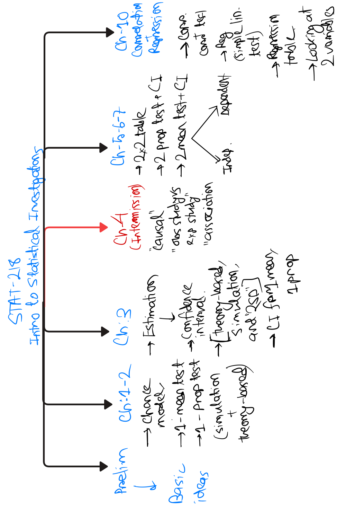
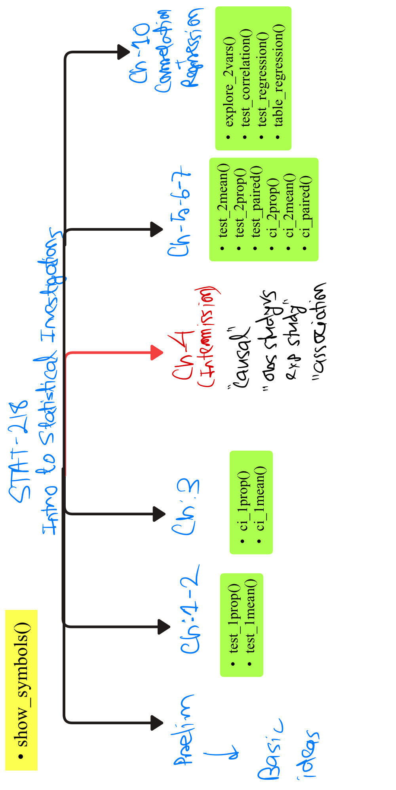

```{r setup, include = FALSE}
knitr::opts_chunk$set(
  collapse  = TRUE,
  comment   = "#>",
  eval      = FALSE
)
library(Stat218Applet)
```

------------------------------------------------------------------------

## What Is This Package?

This package grew out of teaching **STAT 218: Introduction to Statistics** at the University of Nebraska-Lincoln. The course follows the textbook *Introduction to Statistical Investigations* (ISI) by Tintle et al., which comes with its own web-based applet for running simulations. That applet works, but it keeps students at arm's length from real data analysis tools.

**Stat218Applet** brings that same workflow into R and RStudio so that students can:

-   Run hypothesis tests and confidence intervals using the same language as the ISI textbook
-   See polished, quality visualizations directly in R
-   Start building intuition for how R works: storing objects, reading documentation, working with data frames
-   Move seamlessly between textbook exercises (summary statistics) and real data projects (raw data)

The package covers **Chapters 2, 3, 5, 6, 7, and 10** of ISI. Here is how the textbook chapters map onto the package:

------------------------------------------------------------------------

### Chapters/topics covered in STAT-218



------------------------------------------------------------------------

### Functions in this package (and how they relate to STAT-218



------------------------------------------------------------------------

## How Every Function Works

Every function in this package returns an **S3 object**; a named result you store in a variable and then explore in three ways:

-   `print(result)` — a clean, labeled summary written for a freshman audience
-   `plot(result)` — a visualization of the null distribution or confidence interval
-   `plot_steps(result)` — a step-by-step breakdown showing the formula, the numbers, and the final answer

This three-step rhythm is consistent across all 15 functions. Once you learn it for `test_1prop()`, you already know how to use `test_2mean()`.

------------------------------------------------------------------------

## A Note on Terminology

This package uses the ISI textbook's language directly. The three inference methods are called **2SD**, **simulation**, and **theory**:

-   **2SD** ; a simulation-based confidence interval using *statistic ± 2 × SD of the bootstrap distribution*. Restricted to 95% CIs, exactly as the book introduces it.
-   **simulation** ; the full bootstrap or randomization approach, works for any confidence level or hypothesis direction.
-   **theory** ; formula-based inference using Z or T distributions, appropriate when validity conditions are satisfied.

------------------------------------------------------------------------

## Dual Input Routing

Every function accepts input **two ways**:

1.  **Summary statistics** ; pass in numbers directly, exactly like a textbook exercise
2.  **Raw data** ; pass in a formula and a data frame, exactly like a real project

The function works with any R data frame ; whether it is a bundled ISI dataset, an imported CSV, or one of R's own built-in datasets. The error messages are written in plain English. If you supply the wrong combination of arguments, the message tells you exactly what went wrong and how to fix it.

------------------------------------------------------------------------

# Chapter 2--3: One Variable Inference

## The Chance Model

Before we test anything, we need a mental model for what *chance alone* would produce. In ISI, this is called the **chance model** ; the assumption baked into the null hypothesis that any pattern we observe could have happened by random luck.

The null hypothesis is always the skeptic's position: *"Nothing interesting is going on. This result is just chance."* The alternative hypothesis is the research claim: *"There is a real effect here."*

When we run a simulation, we are essentially asking: **if the null hypothesis were true, how often would we see a result as extreme as ours?** That frequency is the p-value. When p is small, the observed result is hard to explain by chance alone ; and we have evidence against the null.

------------------------------------------------------------------------

## test_1prop() —\> One Proportion Test

**Chapter 2 of ISI**

### Example 1 —\> Summary Statistics, Theory Method

A professor claims that more than 60% of students pass the first exam in an introductory statistics course. In a random sample of 80 students from past semesters, 54 passed. Is there statistical evidence to support the professor's claim?

-   **Null hypothesis:** π = 0.60 (the pass rate is exactly 60%)
-   **Alternative hypothesis:** π \> 0.60 (the pass rate is higher than claimed)

Before running the test, pull up the function documentation to see all available arguments:

```{r test_1prop_help, eval=F}
?test_1prop
```

```{r test_1prop_ex1, eval=F}
result <- test_1prop(
  successes   = 54,
  n           = 80,
  null_pi     = 0.60,
  alternative = "greater",
  method      = "theory"
)
plot(result)
plot_steps(result)
```

> The p-value is annotated directly on the shaded tail. The label **"SD of Null Distribution"** tells students what the denominator of the Z-statistic represents ; the standard deviation of what chance alone would produce.

------------------------------------------------------------------------

### Example 2 —\> Summary Statistics, Simulation Method

A coin-flipping experiment tests whether a particular coin is fair. In 100 flips, the coin lands heads 61 times. Is this enough evidence to conclude the coin is biased in either direction?

-   **Null hypothesis:** π = 0.50 (the coin is fair)
-   **Alternative hypothesis:** π ≠ 0.50 (the coin is biased)

Here we use simulation with 2000 repetitions and ask `plot_steps()` to mark the significance threshold at α = 0.05.

```{r test_1prop_ex2}
result <- test_1prop(
  successes   = 61,
  n           = 100,
  null_pi     = 0.50,
  alternative = "two.sided",
  method      = "simulation",
  sim_reps    = 2000
)
print(result)
plot(result)
plot(result, plot_type = "dotplot")
plot_steps(result, alpha = 0.05)
```

> Notice that `plot()` defaults to a histogram of the simulated null distribution. Switching to `plot_type = "dotplot"` shows each individual simulated statistic as a dot; a more transparent view of the randomization process that works especially well in small-sample demonstrations.

------------------------------------------------------------------------

### Example 3 —\> Raw Data, The Dolphin Study

A marine biologist is studying whether a bottlenose dolphin named Buzz can communicate with his trainer using signals. In a series of 16 trials, Buzz correctly identified the target 15 times. If Buzz were just guessing, we would expect him to be right about 50% of the time. The bundled `dolphin` dataset contains the raw trial-by-trial responses.

```{r test_1prop_ex3}
data(dolphin)

result_dolphin <- test_1prop(
  formula       = ~ response,
  data          = dolphin,
  success_level = "Improve",
  null_pi       = 0.5,
  alternative   = "greater",
  method        = "simulation",
  sim_reps      = 1000
)
print(result_dolphin)
plot(result_dolphin)
```

------------------------------------------------------------------------

### ⚠️ Common Mistake —\> Theory Based with small sample size

**The problem:** A student wants to run a theory-based test for one proportion, but in the problem statement, the sample size is clearly not fulfilled to do that.

**Example:** A student reads that a rare genetic trait appears in 5% of a population. In a small biology lab study, they test 30 participants and find 3 with the trait. They want to run a theory-based Z-test to see if their sample proportion differs from 5%.

```{r test_1prop_error}
test_1prop(
  successes   = 3,
  n           = 30,
  null_pi     = 0.05,
  alternative = "two.sided",
  method      = "theory"
)
```

> A friendly error message explains that theory-based test requires adequate number of successes and failures. It works, but it tells the student to consider using the `method = "simulation` for a more reliable p-value.

------------------------------------------------------------------------

### Validity Conditions for test_1prop()

The theory-based Z-test is only reliable when there are at least **10 successes** and **10 failures** in the sample. When this condition is not met, `print()`, `plot()`, and `plot_steps()` will all display a validity warning. The function still runs — the warning is informational, not a crash. Students see the warning no matter which output method they use.

------------------------------------------------------------------------

## ci_1prop() — One Proportion Confidence Interval

**Chapter 3 of ISI**

### From a Point Estimate to an Interval

A hypothesis test gives us a yes/no answer: is there evidence against the null? A confidence interval gives us something richer; **a range of plausible values for the true population proportion.**

Think of it this way. If your sample proportion p̂ is a single dart thrown at a target, the confidence interval is the boundary you draw around where that dart landed ; capturing the true population proportion π with a stated level of confidence.

------------------------------------------------------------------------

### Example 1 — Summary Statistics, Theory Method

A campus health survey asked 200 students whether they floss daily. 54 said yes. What is a plausible range for the true proportion of all students at this university who floss daily?

```{r ci_1prop_ex1}
result_ci1p <- ci_1prop(
  successes  = 54,
  n          = 200,
  conf_level = 0.95,
  method     = "theory"
)
print(result_ci1p)
plot(result_ci1p)
plot_steps(result_ci1p)
```

> The shaded region in `plot()` **is** the interval — the dart-and-boundary visual. The blue shading captures the plausible values; the unshaded tails are what we ruled out.

------------------------------------------------------------------------

### Example 2 — Raw Data, Simulation, 90% CI

Using the bundled `dolphin` dataset with a 90% confidence level. Since we want something other than 95%, we switch from `"2SD"` to `"simulation"`.

```{r ci_1prop_ex2}
?dolphin
result_ci1p_raw <- ci_1prop(
  formula       = ~ response,
  data          = dolphin,
  success_level = "Improve",
  conf_level    = 0.90,
  method        = "simulation"
)
print(result_ci1p_raw)
plot(result_ci1p_raw)
```

------------------------------------------------------------------------

### ⚠️ Common Mistake — Using 2SD for a Non-95% Interval

**The problem:** A student wants a 90% confidence interval but leaves the method as `"2SD"` without realizing it is restricted to 95%.

```{r ci_1prop_2sd_error}
ci_1prop(
  successes  = 54,
  n          = 200,
  conf_level = 0.90,
  method     = "2SD"
)
```

> The error message explains that the 2SD method is only defined for 95% confidence intervals — because that is how ISI introduces the concept. For any other confidence level, use `method = "simulation"` or `method = "theory"`.

------------------------------------------------------------------------

## test_1mean() — One Mean Test

**Chapter 2--3 of ISI**

### Example 1 — Summary Statistics, Theory Method

A professor suspects that students in her class score higher than the university average of 75 on a standardized assessment. A random sample of 25 students had a mean score of 78.3 with a standard deviation of 9.1. Is there evidence that her students perform above the university average?

-   **Null hypothesis:** μ = 75
-   **Alternative hypothesis:** μ ≠ 75 (two-sided, testing for any difference)

```{r test_1mean_ex1}
result2 <- test_1mean(
  x_bar       = 78.3,
  n           = 25,
  sd_val      = 9.1,
  sd_type     = "sample",
  null_mu     = 75,
  alternative = "two.sided",
  method      = "theory"
)
print(result2)
plot(result2)
plot_steps(result2)
```

> Because the population standard deviation is unknown, `sd_type = "sample"` tells the function to use a **T-test** with n − 1 degrees of freedom. The validity condition here is either a large sample (n ≥ 30) or a roughly symmetric population distribution.

------------------------------------------------------------------------

### Example 2 — Validity Warning in Action

A school administrator claims that students in an accelerated program score higher than 80 on a placement exam. A sample of only 15 students had a mean of 85 with a standard deviation of 8.2. The small sample size makes this a perfect moment to see the validity warning in action.

```{r test_1mean_ex2}
demo1_mean <- test_1mean(
  x_bar       = 85,
  n           = 15,
  sd_val      = 8.2,
  sd_type     = "sample",
  null_mu     = 80,
  alternative = "greater",
  method      = "theory"
)
plot(demo1_mean)
plot_steps(demo1_mean)
```

> With n = 15, the validity warning fires across both `plot()` and `plot_steps()`. It reads: *"Your sample size is n = 15, which is less than 20. The Central Limit Theorem does not guarantee a normal sampling distribution at this size. Proceed only if the underlying data is known to be roughly symmetric. Otherwise, consider using `method = 'simulation'`."* The function still runs — students see the result and the warning side by side, which makes for a natural class discussion.

------------------------------------------------------------------------

### Example 3 — Raw Data, Simulation

The average fuel efficiency for cars in the 1970s was often cited around 18 mpg. The `mtcars` dataset contains fuel efficiency data for 32 car models from that era. Is there evidence that the true mean mpg was higher than 18?

```{r test_1mean_ex3}
result3 <- test_1mean(
  formula     = ~ mpg,
  data        = mtcars,
  null_mu     = 18,
  alternative = "greater",
  method      = "simulation"
)
print(result3)
plot(result3)
plot_steps(result3)
```

------------------------------------------------------------------------

### Example 4 — Raw Data, Theory Method

Engine horsepower is another variable in `mtcars`. A mechanic claims the typical engine in this dataset does not produce exactly 150 horsepower on average. We test that two-sided claim using the theory-based T-test.

```{r test_1mean_ex4}
result4 <- test_1mean(
  formula     = ~ hp,
  data        = mtcars,
  null_mu     = 150,
  alternative = "two.sided",
  method      = "theory"
)
print(result4)
plot(result4)
plot_steps(result4)
```

------------------------------------------------------------------------

## ci_1mean() — One Mean Confidence Interval

**Chapter 3 of ISI**

### Example 1 — Summary Statistics, Theory Method

Students in a campus survey reported how much they paid for their last haircut. Across a random sample of 50 students, the mean was \$28.40 with a standard deviation of \$22.80. What is a plausible range for the average haircut cost among all students at this university?

```{r ci_1mean_ex1}
result_ci1m <- ci_1mean(
  x_bar      = 28.40,
  sd_val     = 22.80,
  n          = 50,
  sd_type    = "sample",
  conf_level = 0.95,
  method     = "theory"
)
print(result_ci1m)
plot(result_ci1m)
plot_steps(result_ci1m)
```

------------------------------------------------------------------------

### Example 2 — Raw Data, 2SD Method

The bundled `haircuts` dataset contains individual haircut costs. Here we use the default 2SD method — the first CI method ISI introduces — letting R count and compute directly from the data.

```{r ci_1mean_ex2}
?haircuts
data(haircuts)

result_ci1m_raw <- ci_1mean(
  formula = ~ cost,
  data    = haircuts
)
print(result_ci1m_raw)
plot(result_ci1m_raw)
```

> The `"2SD"` method is intentionally restricted to 95% confidence intervals. This mirrors the ISI textbook's introduction of the concept — the ± 2 SD rule is a clean, memorable entry point before the full multiplier formula is introduced.

------------------------------------------------------------------------

### ⚠️ Common Mistake — 2SD at a Non-95% Level

**The problem:** A student wants a 99% confidence interval but forgets that the 2SD method only works for 95%.

```{r ci_1mean_2sd_error}
ci_1mean(
  x_bar      = 28.40,
  sd_val     = 22.80,
  n          = 50,
  conf_level = 0.99,
  method     = "2SD"
)
```

> The error message blocks the call and redirects the student to either `method = "simulation"` for any confidence level, or `method = "theory"` for a formula-based interval.

------------------------------------------------------------------------

## A Quick Symbol Check

At this point in the course, students are writing hypotheses involving π, p̂, μ, and x̄ ; and the confusion between population parameters and sample statistics is at its peak. The `show_symbols()` function is a reference tool designed to be pulled up during class, during office hours, or any time a student reaches for the wrong letter.

```{r show_symbols_prop}
show_symbols("proportions")
```

```{r show_symbols_means}
show_symbols("means")
```

```{r show_symbols_mistakes}
show_symbols("mistakes")
```

------------------------------------------------------------------------

# Intermission: Chapter 4 Concepts

Before we move to two-variable inference, Chapter 4 of ISI introduces a set of ideas that students carry into every remaining chapter. These are not tested directly by any single function — they are the **conceptual foundation** for everything that follows.

Key ideas from Chapter 4:

-   **Explanatory variable vs. response variable** — which variable is doing the explaining, and which is being explained? In a formula like `response ~ explanatory`, the left side is always the response.
-   **Observational study vs. experiment** — did the researcher assign the explanatory variable (experiment) or just observe it (observational study)? This distinction determines whether we can claim *causation* or only *association*.
-   **Confounding variables** — in an observational study, a third variable may explain the apparent relationship between the explanatory and response variables.
-   **Random assignment vs. random sampling** — random assignment allows causal claims; random sampling allows generalization to a larger population.

These ideas will be in the background of every two-proportion, two-mean, paired, and regression example that follows. When a student asks *"can we say this caused that?"* — the answer always comes back to study design.

> **Coming up:** Chapter 5 introduces the 2×2 contingency table, two-proportion inference, and where the symbol reference for proportions becomes critical again. That is where we pick up next.

------------------------------------------------------------------------

# Chapter 5--7: Two Variable Inference

## A Note on Simulation for Two-Sample Functions

In the one-proportion and one-mean functions, simulation was available regardless of whether you used summary statistics or raw data. For `test_1prop()`, the simulation only needed `n` and `null_pi` to draw random samples from a coin flip. For `test_1mean()`, it used a parametric bootstrap centered at the null value.

The two-sample functions work differently. Here, the simulation is not a coin flip ; it is a **physical shuffle of real data values between groups**. For `test_2prop()`, the null hypothesis says the two groups have the same underlying success rate, so simulation builds a deck containing all the observed successes and failures combined, then repeatedly deals them back into groups of size n₁ and n₂ at random. For `test_2mean()`, the null says the two group means are equal, so simulation pools all individual observations together and randomly reassigns them to groups i.e. a permutation test. For `test_paired()`, the null says the mean difference is zero, so simulation randomly flips the sign of each individual difference ; a sign-flipping test.

In all three cases, **the shuffle operates on individual observations**. Without the raw data values, there is nothing to shuffle. This is why simulation is blocked when you only provide summary statistics for these functions — not as an arbitrary restriction, but because the simulation framework genuinely requires access to the individual data points.

------------------------------------------------------------------------

## Chapter 5: Two Proportions and the 2×2 Table

Chapter 5 of ISI introduces a major conceptual shift: we move from asking about a single proportion to comparing two groups. The first tool students encounter is the **2×2 contingency table** — a cross-tabulation of the explanatory variable (which group?) against the response variable (success or failure?).

This is also where the distinction between **observational study** and **experiment** becomes critical. When a researcher randomly assigns subjects to groups (as in a clinical trial), the 2×2 table can support a causal claim. When the groups are pre-existing (as in a survey), only association can be claimed.

The `test_2prop()` and `ci_2prop()` functions both embed the 2×2 contingency table directly into their `plot()` output — because in ISI, the table is not just a data display tool, it is part of the inference reasoning itself.

------------------------------------------------------------------------

## show_symbols() — Two-Proportion Edition

Before running two-proportion tests, it is worth pausing on the symbols. Students often confuse the pooled proportion p̂\_c with the individual group proportions p̂₁ and p̂₂, and they frequently write π₁ when they mean the difference π₁ − π₂.

```{r show_symbols_2prop}
show_symbols("proportions")
```

------------------------------------------------------------------------

## test_2prop() — Two Proportion Test

**Chapter 5 of ISI**

### Example 1 — Summary Statistics, Theory Method

A pharmaceutical company conducts a clinical trial to test whether a new treatment increases the recovery rate compared to a placebo. In the treatment group, 45 out of 100 patients recovered. In the placebo group, 25 out of 100 recovered. Is there evidence that the treatment and placebo groups have different recovery rates?

-   **Null hypothesis:** π₁ − π₂ = 0 (no difference between groups)
-   **Alternative hypothesis:** π₁ − π₂ ≠ 0 (the groups differ)

```{r test_2prop_ex1}
demo_theory <- test_2prop(
  success_1   = 45,
  n_1         = 100,
  success_2   = 25,
  n_2         = 100,
  group_names = c("Treatment", "Placebo"),
  alternative = "two.sided",
  method      = "theory"
)
plot(demo_theory)
plot_steps(demo_theory)
```

> Notice the clean 2×2 contingency table embedded in the `plot()` output. The `plot_steps()` panel shows the pooled proportion formula — the key distinction between a two-proportion Z-test and a one-proportion Z-test is that the denominator uses a pooled estimate of the common proportion under the null.

------------------------------------------------------------------------

### Example 2 — Summary Statistics, Simulation Method

A school district wants to test whether a new teaching method produces higher pass rates than the traditional approach. In a pilot study, 38 out of 80 students in the new-method classroom passed, compared to 29 out of 80 in the traditional classroom.

```{r test_2prop_ex2}
result2 <- test_2prop(
  success_1   = 38,
  n_1         = 80,
  success_2   = 29,
  n_2         = 80,
  group_names = c("New Method", "Traditional"),
  alternative = "greater",
  method      = "simulation",
  sim_reps    = 2000
)
print(result2)
plot(result2)
plot_steps(result2)
```

------------------------------------------------------------------------

### Example 3 — Raw Data, Theory Method (with Validity Warning)

Using the `mtcars` dataset, we ask: does the proportion of manual-transmission cars differ between straight-engine and V-shaped-engine cars? This is an observational study ; the engine shape was not assigned by a researcher.

```{r test_2prop_ex3}
car_data              <- mtcars
car_data$transmission <- ifelse(mtcars$am == 1, "Manual", "Automatic")
car_data$engine       <- ifelse(mtcars$vs == 1, "Straight", "V-shaped")

result3 <- test_2prop(
  formula       = transmission ~ engine,
  data          = car_data,
  success_level = "Manual",
  alternative   = "two.sided",
  method        = "theory"
)
print(result3)
plot(result3)
plot_steps(result3)
```

> With only 32 cars in `mtcars`, some cells in the 2×2 table may fall below 10 — which triggers the validity warning. The function runs and reports results, but flags that the theory-based Z-test may not be reliable here.

------------------------------------------------------------------------

### Example 4 — Same Data, Simulation Instead

When the validity condition fails, simulation is the right tool. Here we re-run the same question using `method = "simulation"` — the deck shuffle requires raw data, which we already have.

```{r test_2prop_ex4}
result4 <- test_2prop(
  formula       = transmission ~ engine,
  data          = car_data,
  success_level = "Manual",
  alternative   = "two.sided",
  method        = "simulation",
  sim_reps      = 2000
)
print(result4)
plot(result4)
plot_steps(result4, alpha = 0.05)
```

> This is the natural follow-up to Example 3. The teaching moment: when theory fails its validity check, simulation is not just an alternative — it is the more honest approach.

------------------------------------------------------------------------

## Chapter 6: Two Means

### show_symbols() — Two-Mean Edition

Before two-mean inference, it helps to have the symbol table open. The Satterthwaite degrees of freedom formula confuses students, and the distinction between μ₁ − μ₂ (the parameter) and x̄₁ − x̄₂ (the statistic) needs to be explicit.

```{r show_symbols_means2}
show_symbols("means")
```

------------------------------------------------------------------------

## test_2mean() — Two Mean Test

**Chapter 6 of ISI**

### Example 1 — Summary Statistics, Theory Method (with Validity Warning)

A researcher is comparing two drug treatments for pain relief. Treatment A was given to 15 patients (mean score 8.5, SD 1.2) and Treatment B to 18 patients (mean score 7.1, SD 1.8). Is there evidence that Treatment A produces higher pain relief scores on average?

-   **Null hypothesis:** μ₁ − μ₂ = 0
-   **Alternative hypothesis:** μ₁ − μ₂ \> 0 (Treatment A is better)

```{r test_2mean_ex1}
demo_t_warning <- test_2mean(
  x_bar_1     = 8.5,
  sd_1        = 1.2,
  n_1         = 15,
  x_bar_2     = 7.1,
  sd_2        = 1.8,
  n_2         = 18,
  group_names = c("Treatment A", "Treatment B"),
  sd_type     = "sample",
  alternative = "greater",
  method      = "theory"
)
demo_t_warning
plot(demo_t_warning)
plot_steps(demo_t_warning)
```

> With n₁ = 15 and n₂ = 18, at least one group falls below the validity threshold of 20. The warning fires and recommends simulation if the within-group distributions are not roughly symmetric. Notice how `plot_steps()` switches to the T-statistic formula and shows the Satterthwaite degrees of freedom — the package handles this automatically based on `sd_type = "sample"`.

------------------------------------------------------------------------

### ⚠️ Common Mistake — Simulation Blocked with Summary Statistics

**The problem:** A student has summary statistics from a textbook exercise and wants to run a permutation test. Since simulation for two means requires shuffling individual observations between groups, it cannot run on summary statistics alone.

```{r test_2mean_sim_error}
test_2mean(
  x_bar_1 = 10,
  sd_1    = 2,
  n_1     = 30,
  x_bar_2 = 8,
  sd_2    = 2.5,
  n_2     = 30,
  method  = "simulation"
)
```

> The error message explains precisely why: the simulation works by shuffling individual data values between groups — and with only summary statistics, there are no individual values to shuffle. The student is directed to either use `method = "theory"` or provide raw data.

------------------------------------------------------------------------

### Example 2 — Raw Data from a Bundled Dataset (with validity warning)

The `haircuts` dataset contains self-reported haircut costs for male and female students. Is there evidence that male and female students differ in how much they spend on haircuts on average?

```{r test_2mean_ex2}
?haircuts
data(haircuts)

result_2m <- test_2mean(
  formula = cost ~ sex,
  data    = haircuts,
  method  = "theory"
)
print(result_2m)
plot(result_2m)
plot_steps(result_2m)
```

------------------------------------------------------------------------

## ci_2mean() — Two Mean Confidence Interval

**Chapter 6 of ISI**

### Example 1 — Summary Statistics, Theory Method

A biologist studying beetle rolling behavior compares two cap color groups. Black-capped beetles (n = 49) had a mean rolling time of 15.297 seconds (SD 2.429). Clear-capped beetles (n = 52) had a mean of 12.8 seconds (SD 2.1). What is a plausible range for the true difference in mean rolling times?

```{r ci_2mean_ex1}
demo_ci_2mean <- ci_2mean(
  x_bar_1     = 15.297,
  sd_1        = 2.429,
  n_1         = 49,
  x_bar_2     = 12.8,
  sd_2        = 2.1,
  n_2         = 52,
  group_names = c("Black Caps", "Clear Caps"),
  conf_level  = 0.95,
  sd_type     = "sample",
  method      = "theory"
)
plot(demo_ci_2mean)
plot_steps(demo_ci_2mean)
```

> The `plot()` output for `ci_2mean()` shows a two-tier forest plot — the individual group intervals on one tier and the interval for the difference on another. The `plot_steps()` panel renders the unpooled standard error formula, which is the key distinction from the hypothesis test (which pools under the null).

------------------------------------------------------------------------

### Example 2 — Raw Data from a Bundled Dataset

Using the `haircuts` dataset to construct a confidence interval for the difference in mean haircut cost between male and female students.

```{r ci_2mean_ex2}
result_ci2m <- ci_2mean(
  formula = cost ~ sex,
  data    = haircuts,
  method  = "2SD"
)
print(result_ci2m)
plot(result_ci2m)
```

------------------------------------------------------------------------

## Chapter 7: Paired Data

### The Key Distinction

Paired data arises when each subject contributes **two related measurements** — a before/after reading, a left/right measurement, or two treatments applied to the same subject. Because the two measurements within each pair are linked, we work with the **differences** rather than treating the groups as independent.

This is the gateway to understanding dependence in data — a concept that carries forward into correlation and regression. The paired T-test is not just a special case of the two-mean test; it is a fundamentally different framework.

The `test_paired()` and `ci_paired()` functions accept input in three formats: summary statistics (mean difference, SD of differences, number of pairs), a single differences column, or two before/after columns.

------------------------------------------------------------------------

## test_paired() — Paired Data Test

**Chapter 7 of ISI**

### Example 1 — Summary Statistics, Theory Method

A sports scientist measures reaction time (in milliseconds) for 22 athletes before and after a caffeine intervention. The mean difference (after minus before) was −12.4 ms with a standard deviation of 8.6 ms. Is there evidence that caffeine reduces reaction time?

-   **Null hypothesis:** μ_d = 0 (caffeine has no effect)
-   **Alternative hypothesis:** μ_d \< 0 (caffeine reduces reaction time)

```{r test_paired_ex1}
result_paired <- test_paired(
  x_bar_d     = -12.4,
  sd_d        = 8.6,
  n_d         = 22,
  name        = "After - Before",
  alternative = "less",
  method      = "theory"
)
print(result_paired)
plot(result_paired)
plot_steps(result_paired)
```

------------------------------------------------------------------------

### Example 2 — Raw Data, Two-Column Formula

The bundled `firstbase` dataset contains measurements of first-base bag width at 22 baseball fields — one measurement for the wide side and one for the narrow side of each bag. Is there evidence that the wide side is systematically larger than the narrow side?

```{r test_paired_ex2}
data(firstbase)

result_paired_raw <- test_paired(
  formula     = wide ~ narrow,
  data        = firstbase,
  name        = "Wide - Narrow",
  alternative = "greater",
  method      = "theory"
)
print(result_paired_raw)
plot(result_paired_raw)
plot_steps(result_paired_raw)
```

------------------------------------------------------------------------

### Example 3 — Raw Data, Simulation (Sign-Flipping)

The bundled `jjvsbicycle` dataset compares travel times for two routes. Using sign-flipping simulation: under the null hypothesis that there is no difference, each observed difference is equally likely to be positive or negative — so we randomly flip signs and see how extreme our observed mean difference is.

```{r test_paired_ex3}
data(jjvsbicycle)

result_paired_sim <- test_paired(
  formula     = bicycle ~ jj,
  data        = jjvsbicycle,
  name        = "Bicycle - JJ",
  alternative = "two.sided",
  method      = "simulation",
  sim_reps    = 1000
)
print(result_paired_sim)
plot(result_paired_sim)
```

> The sign-flipping simulation is the paired equivalent of the deck shuffle in `test_2prop()`. Both ask the same question: *if there were truly no difference, how often would we see a result as extreme as ours by chance alone?*

------------------------------------------------------------------------

------------------------------------------------------------------------

# Chapter 10: Correlation and Regression

## The Final Chapter — and a Natural Destination

Most STAT 218 instructors skip Chapter 8 (probability) and move directly from paired inference into Chapter 10. That transition is not arbitrary ; paired data is where students first grapple with the idea that two variables measured on the same subject are related. Chapter 10 takes that intuition and formalizes it: instead of asking whether the *mean* of paired differences is zero, we ask whether a quantitative explanatory variable *linearly predicts* a quantitative response.

The jump from two-mean inference to regression is conceptually significant. In Chapters 5--7, the explanatory variable was always categorical (group membership). In Chapter 10, the explanatory variable is quantitative, and the question shifts from *"do the groups differ?"* to *"as x increases, what happens to y, and is that relationship stronger than chance alone?"*

This package provides four tools for Chapter 10:

-   `explore_2vars()` — always the first step: visualize the relationship before testing anything
-   `table_regression()` — a formatted regression or ANOVA decomposition table
-   `test_correlation()` — tests whether the true population correlation ρ is different from zero
-   `test_regression()` — tests whether the true population slope β₁ is different from zero

The `show_symbols("regression")` call is worth pulling up here too — the symbols for regression (β₀, β₁, b₀, b₁, ρ, r) are new to students and easy to confuse.

```{r show_symbols_regression}
show_symbols("regression")
```

------------------------------------------------------------------------

## explore_2vars() — Visual Exploration

**Always run this before any inference.** The function automatically detects variable types and routes to the right display:

-   **Both numeric, `fit_line = FALSE` (default):** Correlation mode — crosshairs at the sample means, correlation coefficient annotated, strength interpretation in the subtitle
-   **Both numeric, `fit_line = TRUE`:** Regression mode — least-squares line overlaid, fitted equation and R² in a second panel
-   **Numeric response, categorical explanatory:** Boxplot mode — side-by-side boxplots with jittered points, group means marked as red triangles, and sample sizes annotated

------------------------------------------------------------------------

### Boxplot Mode — Numeric Response, Categorical Explanatory

Use this before `test_2mean()` or `ci_2mean()` to see the group distributions side by side.

A cycling study compared ride times between carbon-frame and steel-frame bikes. Before running a two-mean test, we visualize the distributions:

```{r explore_boxplot_ex1}
data(biketimes)
explore_2vars(formula = time ~ frame, data = biketimes)
```

A sleep deprivation study asked whether unrestricted sleep leads to better reaction time improvement. Each participant was assigned to either a sleep-restricted or unrestricted condition:

```{r explore_boxplot_ex2}
data(sleep)
explore_2vars(formula = time ~ sleep, data = sleep)
```

A study on breastfeeding and cognitive development measured general cognitive index (GCI) scores for children who were breastfed versus those who were not:

```{r explore_boxplot_ex3}
data(breastfeedintell)
explore_2vars(formula = gci ~ feeding, data = breastfeedintell)
```

The built-in `mtcars` dataset works just as well. Do cars with different numbers of cylinders produce different fuel efficiency? Note that `cyl` is numeric in `mtcars` but behaves as a grouping variable here — the function handles this automatically:

```{r explore_boxplot_ex4}
explore_2vars(formula = mpg ~ cyl, data = mtcars)
```

------------------------------------------------------------------------

### ⚠️ Friendly Behavior ; fit_line = TRUE with a Categorical Explanatory

**What happens:** A student passes `fit_line = TRUE` but the explanatory variable is categorical. Fitting a regression line to a categorical x does not make sense, so the function ignores `fit_line`, produces a boxplot anyway, and sends a friendly informational message explaining what happened.

```{r explore_fitline_categorical}
data(haircuts)
explore_2vars(formula = cost ~ sex, data = haircuts, fit_line = TRUE)
```

> The student gets the right plot and a nudge toward correct usage.

------------------------------------------------------------------------

### Correlation Mode — Both Numeric, No Fit Line

Use this first when both variables are quantitative, before deciding whether to run `test_correlation()`.

Body temperature and heart rate — is there a linear association between these two physiological measurements?

```{r explore_corr_ex1}
data(tempheart)
explore_2vars(formula = heart_rate ~ body_temp, data = tempheart)
```

The Vietnam draft lottery: birth date was supposed to be randomly assigned a draft number. If the lottery was truly random, we would expect no correlation between sequential birth date and draft number:

```{r explore_corr_ex2}
data(draftlottery)
explore_2vars(formula = draft_number ~ sequential_date, data = draftlottery)
```

Foot length and height — a classic anthropometric relationship:

```{r explore_corr_ex3}
data(footheight)
explore_2vars(formula = height ~ footlength, data = footheight)
```

------------------------------------------------------------------------

### Regression Mode — Both Numeric, fit_line = TRUE

Add the least-squares line and equation panel when you are ready to model the relationship formally.

Does study time predict GPA?

```{r explore_reg_ex1}
data(gpa)
explore_2vars(formula = gpa ~ hours, data = gpa, fit_line = TRUE)
```

Was birth date a predictor of draft number? If the lottery were truly random, the slope should be near zero:

```{r explore_reg_ex2}
explore_2vars(
  formula  = draft_number ~ sequential_date,
  data     = draftlottery,
  fit_line = TRUE
)
```

------------------------------------------------------------------------

### Grouping — Correlation and Regression by Subgroup

Pass a `group` argument to split the scatterplot by a categorical variable. In correlation mode this draws separate crosshairs per group; in regression mode it draws separate colored lines and stacks their equations.

The draft lottery split by first vs. second half of the year — if the shuffle was biased toward earlier birth dates receiving lower numbers, we would see the two halves diverge:

```{r explore_group_corr}
draftlottery$half <- ifelse(draftlottery$sequential_date <= 183, "First Half", "Second Half")

explore_2vars(
  formula = draft_number ~ sequential_date,
  data    = draftlottery,
  group   = "half"
)
```

The same split in regression mode — separate fitted lines reveal whether the slope differs between the two halves of the year:

```{r explore_group_reg}
explore_2vars(
  formula  = draft_number ~ sequential_date,
  data     = draftlottery,
  group    = "half",
  fit_line = TRUE
)
```

Car weight and fuel efficiency in `mtcars`, grouped by engine shape. The function dynamically maps colors, draws two separate regression lines, and stacks the individual equations in the equation panel:

```{r explore_group_mtcars}
mtcars$engine_type <- ifelse(mtcars$vs == 0, "V-Shaped", "Straight")

explore_2vars(
  formula  = mpg ~ wt,
  data     = mtcars,
  group    = "engine_type",
  fit_line = TRUE
)
```

------------------------------------------------------------------------

## table_regression() — Regression and ANOVA Tables

Before running a formal test, `table_regression()` produces a polished formatted table summarizing the linear model. There are two output types:

-   `table_type = "regression"` (default) — slope, intercept, standard errors, confidence interval, t-statistic, and p-value
-   `table_type = "anova"` — ANOVA decomposition showing SS_model, SS_error, SS_total, degrees of freedom, mean squares, and the F-statistic

------------------------------------------------------------------------

### Regression Tables

Does car weight predict fuel efficiency? Each additional 1000 lbs of weight is associated with how many fewer miles per gallon?

```{r table_reg_mtcars}
table_regression(formula = mpg ~ wt, data = mtcars)
table_regression(formula = mpg ~ wt, data = mtcars, table_type = "anova")
```

Same model, but with a 99% confidence interval for the slope:

```{r table_reg_mtcars_99}
table_regression(formula = mpg ~ wt, data = mtcars, conf_level = 0.99)
```

Does sepal length predict petal length in the iris dataset?

```{r table_reg_iris}
table_regression(formula = Petal.Length ~ Sepal.Length, data = iris)
```

Does study time predict GPA? An ISI dataset with a natural research question students can relate to:

```{r table_reg_gpa}
data(gpa)
table_regression(formula = gpa ~ hours, data = gpa)
```

------------------------------------------------------------------------

### ANOVA Tables

The ANOVA decomposition table reframes the same linear model as a partitioning of total variability — how much of the variation in the response is explained by the model versus left in the residuals?

```{r table_anova_mtcars}
table_regression(formula = mpg ~ wt, data = mtcars, table_type = "anova")
```

```{r table_anova_iris}
table_regression(
  formula    = Petal.Length ~ Sepal.Length,
  data       = iris,
  table_type = "anova"
)
```

```{r table_anova_gpa}
table_regression(formula = gpa ~ hours, data = gpa, table_type = "anova")
```

> The ANOVA and regression tables are two views of the same underlying model. The F-statistic in the ANOVA table and the T-statistic for the slope in the regression table are directly related — F = T² when there is one predictor. Students who see both tables side by side often have that realization on their own.

------------------------------------------------------------------------

## test_correlation() — Correlation Test

**Chapter 10 of ISI**

The correlation test asks: is the observed linear association between two variables stronger than what chance alone would produce if ρ = 0? The null hypothesis is always H₀: ρ = 0.

------------------------------------------------------------------------

### Example 1 — Summary Statistics, Theory Method

A textbook exercise reports that the correlation between study hours and exam score in a sample of 42 students was r = 0.38. Is this correlation statistically significant?

-   **Null hypothesis:** ρ = 0 (no linear association)
-   **Alternative hypothesis:** ρ \> 0 (positive association)

```{r test_corr_ex1}
result_corr_ss <- test_correlation(
  r_obs       = 0.38,
  n           = 42,
  alternative = "greater",
  method      = "theory"
)
print(result_corr_ss)
plot(result_corr_ss)
plot_steps(result_corr_ss)
```

------------------------------------------------------------------------

### Example 2 — Raw Data, Simulation

Researchers hypothesized that as social network size increases, the density of connections within a person's network decreases. Does the `facebook` dataset support a negative correlation between number of friends and network density?

```{r test_corr_sim}
data(facebook)

result_corr_sim <- test_correlation(
  formula     = density ~ friends,
  data        = facebook,
  alternative = "less",
  method      = "simulation",
  sim_reps    = 5000
)
print(result_corr_sim)
plot(result_corr_sim)
```

> The correlation simulation works by randomly permuting the response variable values while keeping the explanatory variable fixed — breaking any real association that exists. Each permuted dataset produces a new r value under the null. The p-value is the proportion of those simulated r values as extreme as the observed one.

------------------------------------------------------------------------

### Example 3 — Raw Data, Theory Method, Draft Lottery

The Vietnam War draft lottery assigned numbers 1--366 to birth dates. If the lottery was truly random, draft number should be uncorrelated with birth date. This is one of the most famous examples of a flawed randomization in statistical history.

```{r test_corr_draft}
result_corr_draft <- test_correlation(
  formula     = draft_number ~ sequential_date,
  data        = draftlottery,
  alternative = "two.sided",
  method      = "theory"
)
print(result_corr_draft)
plot(result_corr_draft, plot_type = "dotplot")
plot_steps(result_corr_draft)
```

> A two-sided test here is appropriate — we do not know in advance which direction a bias would run. The result reveals whether the lottery was as random as it was supposed to be.

------------------------------------------------------------------------

## test_regression() — Regression Slope Test

**Chapter 10 of ISI**

The regression test asks: is the observed slope β̂₁ different from zero — or could a slope this large have arisen by chance if the true population slope β₁ were zero? The null hypothesis is always H₀: β₁ = 0.

------------------------------------------------------------------------

### Example 1 — Summary Statistics, Theory Method

A textbook regression output reports a slope of 0.12 with a standard error of 0.041, based on n = 42 observations. Is the slope statistically significant?

```{r test_reg_ex1}
result_reg_ss <- test_regression(
  slope       = 0.12,
  se          = 0.041,
  n           = 42,
  alternative = "two.sided",
  method      = "theory"
)
print(result_reg_ss)
plot(result_reg_ss)
plot_steps(result_reg_ss)
```

------------------------------------------------------------------------

### Example 2 — Raw Data, Theory Method, One-Sided

Do more study hours predict a higher GPA? We expect a positive slope — more hours in, higher GPA out.

```{r test_reg_gpa}
result_reg_gpa <- test_regression(
  formula     = gpa ~ hours,
  data        = gpa,
  alternative = "greater",
  method      = "theory"
)
print(result_reg_gpa)
plot(result_reg_gpa)
plot_steps(result_reg_gpa)
```

------------------------------------------------------------------------

### Example 3 — Raw Data, Simulation

Does foot length predict height? We use simulation with 5000 repetitions — the response values are randomly shuffled across the observed foot lengths, breaking the real association and building a null distribution of slopes.

```{r test_reg_footheight}
result_reg_foot <- test_regression(
  formula     = height ~ footlength,
  data        = footheight,
  alternative = "two.sided",
  method      = "simulation",
  sim_reps    = 5000
)
print(result_reg_foot)
plot(result_reg_foot)
```

------------------------------------------------------------------------

### Example 4 — Raw Data, Theory Method, Exercise and Mood

A study measured exercise intensity and change in mood score for participants in a wellness program. Does higher exercise intensity predict greater mood improvement?

```{r test_reg_exercise}
data(exercisemood)

result_reg_mood <- test_regression(
  formula     = change_mood ~ exercise_intensity,
  data        = exercisemood,
  alternative = "greater",
  method      = "theory"
)
print(result_reg_mood)
plot(result_reg_mood)
plot_steps(result_reg_mood)
```

------------------------------------------------------------------------

## Wrapping Up

This demo has walked through the full arc of STAT 218 — from the chance model and one-variable inference, through two-variable comparisons, all the way to correlation and regression. Every function in the package follows the same rhythm: run it, store it, explore it with `print()`, `plot()`, and `plot_steps()`.

The package is designed to grow alongside students. A student who runs `test_1prop()` in Week 3 and `test_regression()` in Week 13 is using the same workflow — and by the end of the semester, that consistency has quietly taught them how to interact with statistical software.

For full documentation, visit the [Stat218Applet pkgdown site](https://asifenan.github.io/Stat218Applet/).

```{r install_reminder}
# Install or update the package at any time with:
devtools::install_github("AsifEnan/Stat218Applet")
```

------------------------------------------------------------------------
